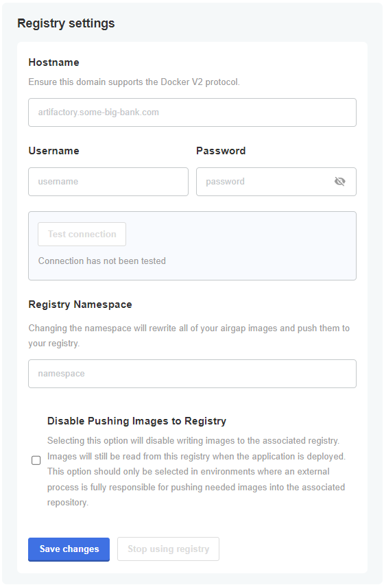
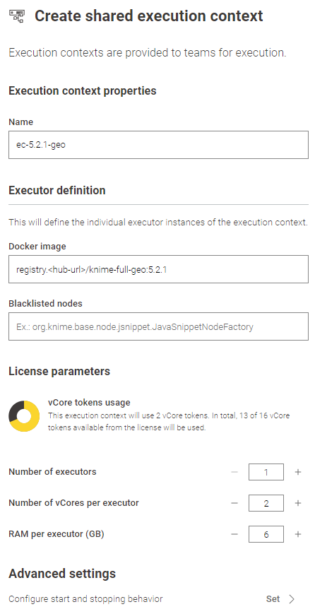

# Setup Custom Executor Docker Image with the Geospatial Extension for KNIME Business Hub


## TL;DR

To run workflows with Geospatial Analytics extension nodes on KNIME Business Hub, you'll need, 
1. a Docker image that includes this extension. You can either use our prebuilt Docker image or create your own—automatically using the Executor Image Builder or manually building it yourself.
2. create an execution context 


## Introduction

Running a workflow on KNIME Business Hub requires an Execution Context (EC). Inside that EC runs one or multiple pods - that hold Docker containers - which run Docker images. In general, one can simply use the official Docker images from the public [KNIME Artifact Registry](https://registry.hub.knime.com/) or [Docker Hub](https://hub.docker.com/r/knime/knime-full) to create an EC. A list of all available default KNIME docker images can be found [here](https://docs.knime.com/latest/business_hub_admin_guide/index.html#docker-executor-images).

However, the official Docker images hold KNIME Extensions only; no Community (trusted or experimental) or Partner Extensions included. Since the "Geospatial Analytics Extension for KNIME" is a Trusted Community Extension, it needs to be integrated into the Docker image, which requires to enhance the official image and build your own custom Docker image.

### Options
This can be achieved in three ways.

1. **Prebuilt**

    - One can use prebuilt docker image with geospatial extension installed from [Docker Hub here](https://hub.docker.com/repository/docker/happybeetles/knime-execution/general). The docker file used for building these Docker image is from [here](https://github.com/spatial-data-lab/knime_docker).


2. **Automatic**
    - One can use the [_"Executor Image Builder"_](https://hub.knime.com/knime/spaces/KNIME%20Business%20Hub%20Admin%20Workflows/Executor%20Image%20Builder~V8b8qdFAdrBOziiD/current-state) Data App that is part of the Administrator Workflows for KNIME Business Hub can be found [here](https://hub.knime.com/knime/spaces/KNIME%20Business%20Hub%20Admin%20Workflows/~6vfL9nZbxwU3yNbU/).
    - This currently only works for online installations. For airgap installations, please refer to the manual steps.
    - See below, for more details.
3. **Manual**
    - One can use the default KNIME docker images (mentioned above), and build on top of it. This requires to create a Dockerfile that pulls the default image and adds the extension while building the custom image.
    - See below, for more details.

### Docker Image Registry

If you are using the first way, you don't have to setup the image registry in the KOTS Admin Console. 

In other two ways, one needs to configure a docker V2 registry to be able to provide the custom image to the KNIME Businss Hub. Here, one can either use the [embedded registry](https://docs.knime.com/latest/business_hub_installation_guide/index.html#embedded-docker-registry-configuration) of the KNIME Business Hub itself, or use an [external registry](https://docs.docker.com/get-started/docker-concepts/the-basics/what-is-a-registry/) (like ECR, ACR, etc.). The latter link also explains what a docker image registry is in general.

In case, you are not using the embedded registry but an external one, you can configure your KNIME Business Hub to use that within the KOTS Admin Console unless you use public-access images from Docker Hub.



Please also refer to the official documentation on [Connecting to an External Registry](https://docs.replicated.com/vendor/packaging-private-images).

## Prebuilt Image

If you choose this option, no action is required to create the image; it is automatically built and published by GitHub Actions.

## Automatic Image Creation

This is the most automatic way to provide a docker image that includes the Geospatial Extension to the KNIME Business Hub. This will allow you to
- create the Dockerfile, 
- build an executor docker image, 
- push it to a registry, and eventually
- make it available when creating or editing an execution context.

Our [documentation](https://docs.knime.com/latest/business_hub_admin_guide/index.html#build-dockerfile-with-data-app) describes the application step by step.

### Requirements
Our [documentation](https://docs.knime.com/latest/business_hub_admin_guide/index.html#add-extension-docker-executor-images) describes the necessary requirements. Among them, one needs 
- to enable the Execution Image Builder within the ```KOTS Admin Console``` > ```Config``` > ```Execution Image Builder``` > check ```Enable Execution Image Builder```
- global admin priviliges
- global admin application password

## Manual Image Creation
If it is desired or necessary to not to go with the Data App (e.g. due to an airgap installation or technical preference), one can do the following steps manually:
- create the Dockerfile,
- build an executor docker image,
- push it to a registry, and eventually
- make it available when creating or editing an execution context

Besides the below steps, our [documentation](https://docs.knime.com/latest/business_hub_admin_guide/index.html#build-image-manually) also describes steps around manual docker image creation.

### Requirements
To be able to build your custom Docker image it is required to run [Docker](https://www.docker.com/), more precisely the [Docker Engine](https://docs.docker.com/engine/install/).
Please make yourself familiar with the install instructions according to your operating system.
In general, you can build the image locally. It is not required that the image is built somewhere on the KNIME Business Hub.

### Dockerfile
The basis of a Docker image is a Dockerfile. It defines
- the source image (in this case the offical Docker image from KNIME; check out all available images [here](https://docs.knime.com/latest/business_hub_admin_guide/index.html#docker-executor-images)),
- the libraries/packages to be installed, and subsequently 
- which extensions should be installed into the executor.

Make sure to save that file with the name ```Dockerfile``` and add no file extension.

Within the Dockerfile, we define two variables at the bottom that are important while installing the extension(s):

```KNIME_UPDATE_SITES``` the URL to the necessary Update Site(s)

```KNIME_FEATURES``` the Feature ID of the extension to be installed

Check out [this video](https://www.youtube.com/watch?v=-dO79Id3VAo&t=143s) from the KNIMETV channel that helps you to find the right update site URL and the feature ID.

    # Define the base image
    FROM knime/knime-full:r-5.3.2-564

    # Change to root user to be able to install system packages
    USER root

    # Update/upgrade package manager and install ca-certificates to enable ca certificates that micromamba (for python) is asking for
    RUN apt-get update && \
        apt-get upgrade -yq && \
        apt-get install -yq \
            ca-certificates && \
        # cleanup
        rm -rf /var/lib/apt/lists/*


    # Change to knime user to handle extensions
    USER knime

    # Define the list of update sites and features
    ENV KNIME_UPDATE_SITES="https://update.knime.com/analytics-platform/5.2,https://update.knime.com/community-contributions/trusted/5.2"

    # Install a feature from the Community Trusted update site
    ENV KNIME_FEATURES=sdl.harvard.features.geospatial.feature.group

    # Execute extension installation script
    RUN ./install-extensions.sh

### Build and push the Docker image
Now, the Docker image can be build from the Dockerfile and made available to the KNIME Business Hub with the following commands.

    # Build the Docker image
    docker build . -f .\Dockerfile -t knime-full-geo:5.2.1 --no-cache

    # Retag the image to make it readable for KNIME Business Hub
    docker tag knime-full-geo:5.2.1 registry.<hub-url>/knime-full-geo:5.2.1

    # Login to the embedded registry of the KNIME Business Hub (if configured)
    docker login --username <username> registry.<hub-url>

    # Push the image to registry
    docker push registry.<hub-url>/knime-full-geo:5.2.1

### Check if the Docker image is available on the registry
Once the upload is finished you can double check if that image can be found on the registry by searching the Docker registry API. Therefore, it is basically enough to use your web browser.

    # Check which image names are available
    $ registry.<hub-url>/v2/_catalog
    {
        "repositories":["knime-full-geo"]
    }

    # Check which tags are available for a dedicated image name
    $ registry.<hub-url>/v2/<image-name>/tags/list
    {
        "name":"knime-full-geo",
        "tags":["5.2.1"]
    }

## Creating an Execution Context
Now you can apply the Docker image and create an EC from it by passing the registry string under the "Docker image" section while creating an EC. Please read the [KNIME docs](https://docs.knime.com/latest/business_hub_user_guide/index.html#execution_contexts) to find out more about how to setup a new execution context.

