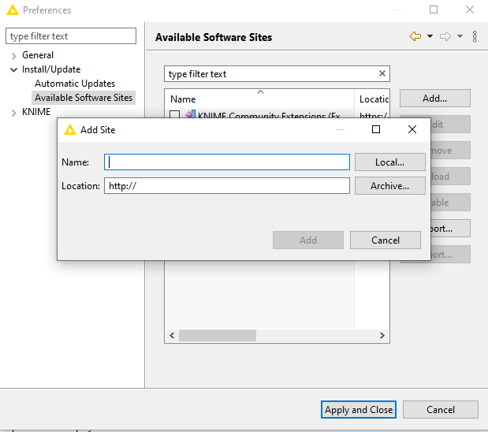
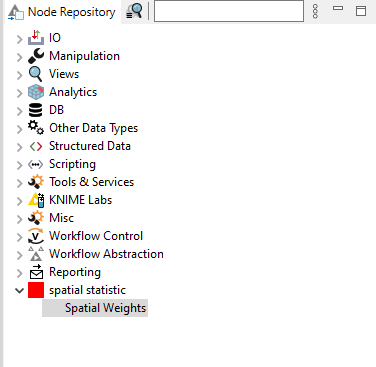
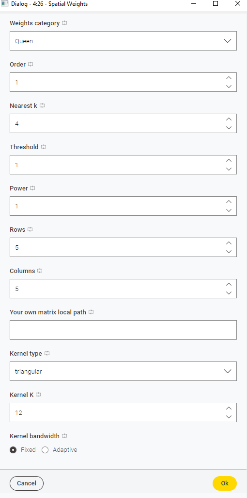
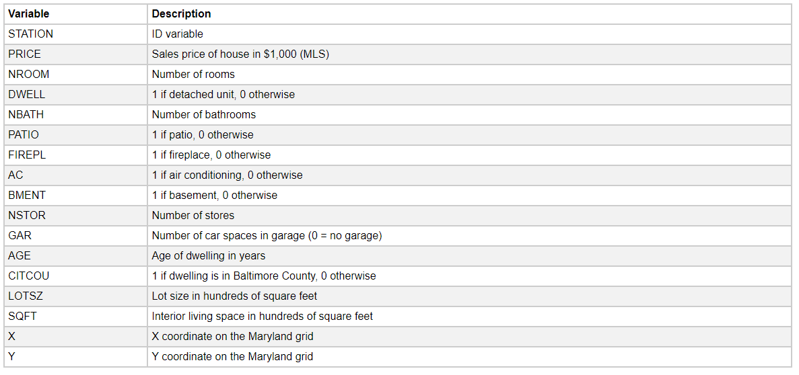
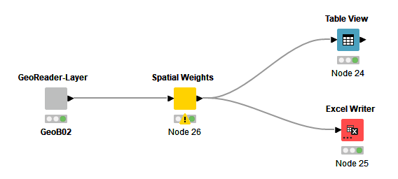
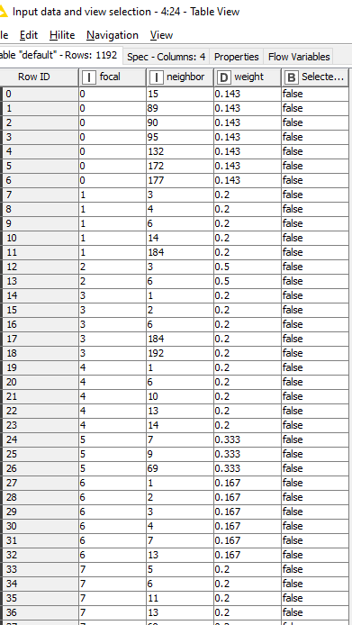

# User Guide for Geosptial extension (sptial weights)

## How to install the extension

You should use Knime 4.7 before start. The extension is build with python 3.9 and libpysal libpysal 4.6.2.   

1. Download the extension from [here](https://drive.google.com/file/d/1SUcQVFK7klSMgdCDvOy5y0PVSOo2JMUE/view?usp=sharing)  (named `my_extension` for now), once it's done, you can download from knimehub.
2. Uzip the file `my_extension.zip` to `your_path/my_extension`
3. Open Knime and click File → Preferences → Install/Update → Available Software Sites, click Add..

Input a name like `my_extension`and click Local... , select the folder you uzipped `your_path/my_extension`. Apply the preferences

4. Install it via File → Install KNIME Extensions

5. Restart the Knime and then you will find the extension in your Node Repository

## Sptial weights References

This node constructs a contiguity spatial weights matrix from the input data. 

- Weights category

The default value is ‘Queen’ which will construct a queen contiguity weights matrix. Queen weights is more robust and more suitable for areal unit data. The queen criterion is somewhat more encompassing and defines neighbors as spatial units sharing a common edge or a common vertex. The rook criterion defines neighbors by the existence of a common edge between two spatial units. Therefore, the number of neighbors according to the queen criterion will always be at least as large as for the rook criterion. When choosing k-nearest, select the nearest number 'Nearest k' in the following options. When selecting Binary Distance Band, please select the distance threshold 'Threshold' in the following options. When selecting Inverse Distance, please select the distance threshold 'Threshold' and the corresponding power 'Power' in the following options. When 'Your own' is selected, please enter the path of the spatial weights matrix in CSV format in the following options. More details about spatial weights, please see the GeoDa center website: https://geodacenter.github.io/documentation.html 

Default value "Queen", Other options "Queen", "Rook", "Inverse Distance", "Binary Distance Band","K nearest","Lattice","Kernel","Your own

- Order

The order of the weight matrix is 1 by default. Users can change the order of the weights, higher order weights will treat further units as neighbors

- Nearest k
K-nearest are often used for point data. k is the number of the nearest neighbor

- Threshold

Distance band weights are often used for point data. The weights within the threshold are 1 and otherwise 0. Inverse distance weights are often used for point data. The weights within the threshold are distance^-power, and otherwise 0. The distance is Euclidean distance

- Power

Distance band weights are often used for point data. The weights within the threshold are 1 and otherwise 0. Inverse distance weights are often used for point data. The weights within the threshold are distance^-power, and otherwise 0. The distance is Euclidean distance.

- Rows

Choose the rows and columns of your lattice.

- Columns

Choose your rows and columns of your lattice

- Your own matrix local path

Please enter the path of the spatial weights matrix in CSV format in the following options. The weights matrix must be in matrix format and in the order of the samples.

- Kernel type

Default is triangular, other options include "triangular","uniform","quadratic","quartic","gaussian"

- Kernel K

 Default is 12
 
- Kernel bandwidth

Default is "Fixed", other options include "Fixed","Adaptive"

## Examples

The example show how to use the sptial weights nodes to calculate the sptial weights of points data (Baltimore Home Location). The example workflow can be downlaod [here]().

### Data

Baltimore Home Sales 1970s (https://geodacenter.github.io/data-and-lab/baltim/),Download from [here](https://drive.google.com/file/d/1Fa7lK4HvxuF2QwCe9oo_vXv1n_uiHsvV/view?usp=sharing). Data overview as below,

### Workflow

Overview of the work flow.

#### How to run 

1. Download the workflow and import to Knime
2. Downlaod the data
3. Dobble click the `GeoReader-Layer` node and select the downloaded data from setp2
4. click excute all executable nodes in the tool bar

#### Explanation

- GeoReader-Layer

This node read geo-package format data. Dobble click to select the geo-package data.

- Sptial Weights

This node calulcate the Sptial weights of points or ploygon data. more detilas see Sptial weights References

- Table View

The data view of the sptial weight 

- Excel Writer

Write sptial weight into local drive as excel file.

### The results

The table view should look like as below,

